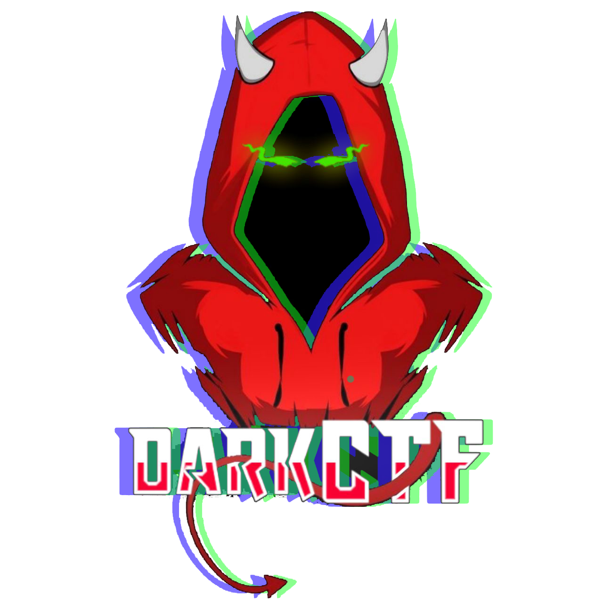

<h1>Dark Army</h1>

## Who we are?

Dark Army is an international CTF team based in Inida and open for all to join. 
We have a large and diverse community of professinals and learners who learn and enjoy at the same time in a great competitive environment. 

## What can you expect if you are here?
>ping! Hey there's the notification for a CTF. 
>> *literally everyone* Let's do it !!

## DarkCTF Coming soon...
We are organising a jopardy style Capture The Flag for all the hackers out there.  
Anyone can join from a top tier cybersecurity expert to an enthusiastic beginner.
We gaurantee it's going to be `Fun For All`

## Our arsenal of Challanges
1. Web
2. Miscellaneous
3. Forensics
4. Reversing
5. Pwn
6. Crypto
7. OSINT

Have an idea and want to get it in our CTF? Remember we are Open for All ^_^

#### Ultimate Goal --> FLAGS! Capture 'em all!

## Add image links
[github](https://github.com/TeamDarkArmy)
[ctftime](https://ctftime.org/team/26569)
[Discord](https://discord.gg/b4YKgju)

